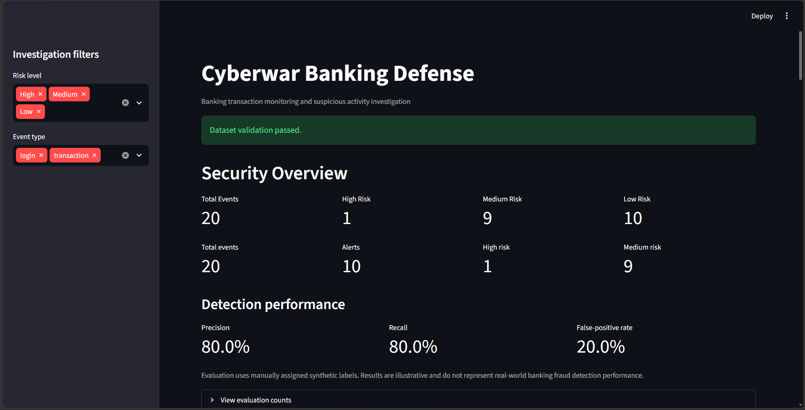
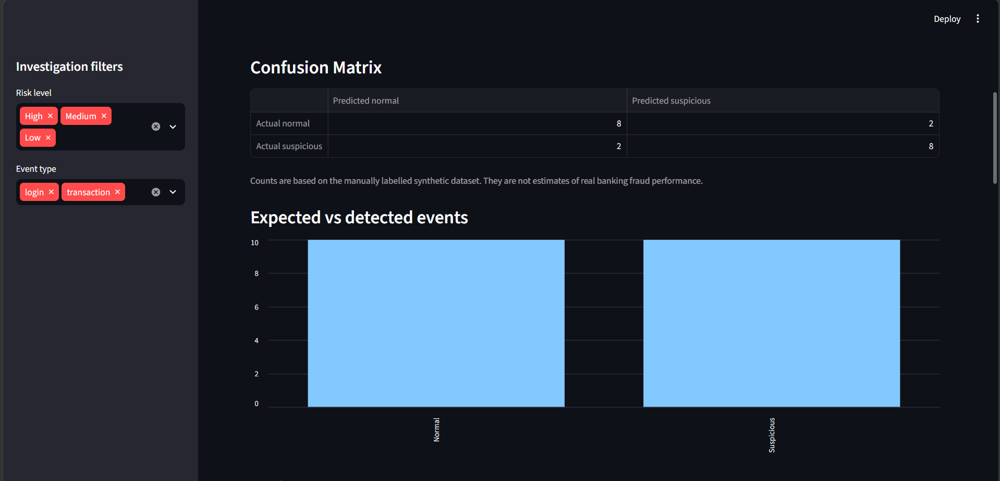
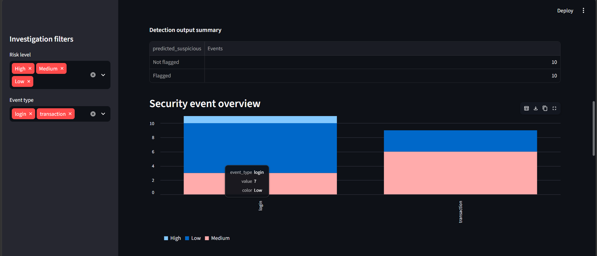
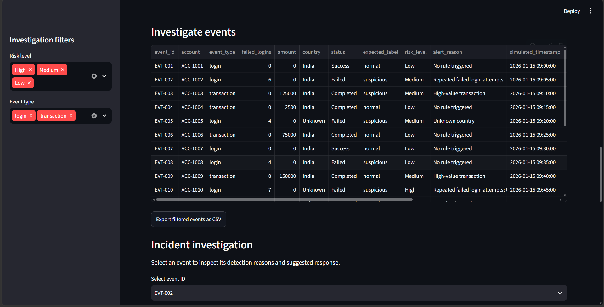
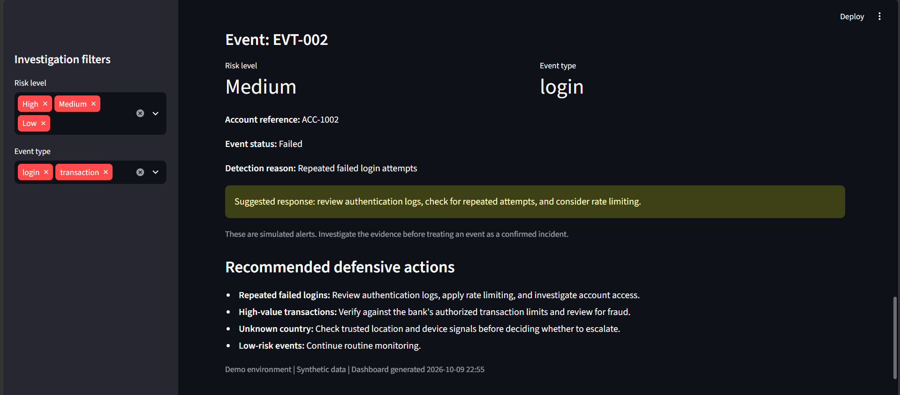
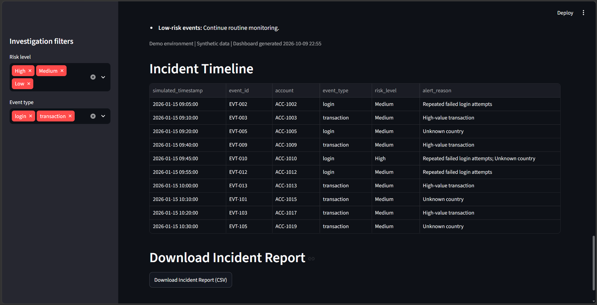

# Cyberwar Banking Defense
**Live Demo:** [Open Cyberwar Banking Defense](https://cyberwar-banking-defense.streamlit.app/)
## Overview

Cyberwar Banking Defense is a Python-based educational project that demonstrates how suspicious banking activity can be identified using rule-based detection, dataset validation, and an interactive Streamlit dashboard.

The project analyzes simulated banking events, assigns risk levels, provides reasons for alerts, and suggests investigation actions.

**Note:** This is a learning and portfolio project. It does not connect to real banking systems and is not intended for production fraud detection.

## Features

- **Rule-based detection:** Identifies events involving repeated failed login attempts, high-value transactions, and unknown countries.
- **Risk classification:** Assigns Low, Medium, or High risk based on the detection rules.
- **Dataset validation:** Checks for missing columns, duplicate event IDs, invalid values, and unexpected labels.
- **Interactive dashboard:** Displays event summaries and suspicious activity.
- **Incident timeline:** Presents medium- and high-risk events in chronological order using simulated timestamps.
- **Investigation recommendations:** Provides suggested actions for reviewing detected events.
- **CSV incident report:** Allows suspicious events and their investigation details to be exported.
- **Automated tests:** Includes unit tests for detection and dataset validation.

## Technology Stack

- Python
- Pandas
- Streamlit
- unittest

## Project Structure

```text
cyberwar-banking-defense/
├── app.py
├── detector.py
├── validate_data.py
├── test_detector.py
├── test_validate_data.py
├── requirements.txt
├── README.md
└── data/
    └── banking_events.csv
```

## Installation

### 1. Clone the repository

```bash
git clone YOUR_GITHUB_REPOSITORY_URL
cd cyberwar-banking-defense
```

Replace `YOUR_GITHUB_REPOSITORY_URL` with your actual GitHub repository URL.

### 2. Create a virtual environment

```bash
python -m venv .venv
```

Activate it on Windows PowerShell:

```powershell
.\.venv\Scripts\Activate.ps1
```

### 3. Install dependencies

```bash
python -m pip install -r requirements.txt
```

## Run the Application

```bash
python -m streamlit run app.py
```

Streamlit will provide a local URL that you can open in your browser.

## Run Automated Tests

```bash
python -m unittest -v
```

The detection and validation tests should pass before changes are considered complete.

## Detection Rules

| Condition | Example response |
|---|---|
| Repeated failed login attempts | Review authentication logs and verify account activity |
| High-value transaction | Verify the transaction against approved activity |
| Unknown country | Review the location and investigate unusual access |

Risk classification is based on the number of triggered rules. Multiple triggered rules result in a High risk classification; one triggered rule results in Medium risk; no triggered rules results in Low risk.

## Evaluation and Limitations

The project includes a synthetic dataset with reference labels for demonstrating evaluation metrics. These labels are illustrative and should not be treated as verified fraud outcomes.

Performance metrics calculated from this dataset are not evidence of real-world banking detection accuracy. The detection rules are predefined rather than trained machine-learning models.

The timestamps used in the incident timeline are simulated. Investigation recommendations are suggestions for a human reviewer and do not automatically block accounts or transactions.

## Future Improvements

- Test detection rules on larger, carefully documented datasets.
- Evaluate performance on independently verified reference labels.
- Explore anomaly detection and machine-learning methods.
- Add configurable thresholds and more detailed audit logs.
- Improve security testing and application error handling.

## Disclaimer

This project is intended for educational purposes and cybersecurity portfolio development. It does not provide financial advice, guarantee fraud detection, or replace professional banking security controls.
## Dashboard Preview


## Dashboard Screenshots

### 1. Application Overview


### 2. Security Overview


### 3. Incident Timeline


### 4. Suspicious Activity Detection


### 5. Incident Investigation


### 6. Downloadable Incident Report

